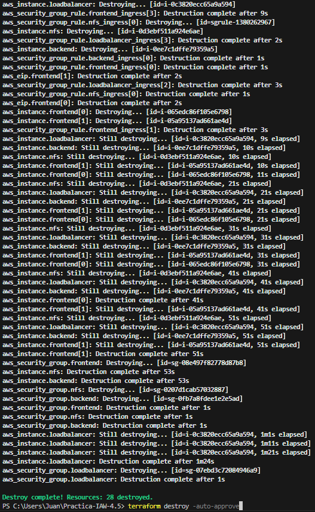

# Practica-IAW-4.5: Terraform en AWS

En esta práctica, crearemos nuestra Infraestructura creada en la práctica 1.11 con terraform en AWS, de forma que sea totalmente automatizada, englobando la creación de instancias, grupos de seguridad así cómo IPs elásticas, posteriormente, procederemos a su eliminación.

## Creación de Nuestra InfraEstructura 

```bash

    provider "aws" {
    region = var.region
    }

    # Creamos el grupo de seguridad del frontend
    resource "aws_security_group" "frontend" {
    name        = var.SECURITY_GROUP_FRONTEND
    description = "Reglas para el frontend"
    }

    # Creamos las reglas para el grupo de seguridad "frontend-sg"
    resource "aws_security_group_rule" "frontend_ingress" {
    count             = 5
    security_group_id = aws_security_group.frontend.id
    type              = "ingress"
    from_port         = [22, 2049, 80, 443, 3306][count.index]
    to_port           = [22, 2049, 80, 443, 3306][count.index]
    protocol          = "tcp"
    cidr_blocks       = ["0.0.0.0/0"]
    }

    # Creamos el grupo de seguridad del backend
    resource "aws_security_group" "backend" {
    name        = var.SECURITY_GROUP_BACKEND
    description = "Reglas para el backend"
    }

    # Creamos las reglas para el grupo de seguridad "backend-sg"
    resource "aws_security_group_rule" "backend_ingress" {
    count             = 2
    security_group_id = aws_security_group.backend.id
    type              = "ingress"
    from_port         = [22, 3306][count.index]
    to_port           = [22, 3306][count.index]
    protocol          = "tcp"
    cidr_blocks       = ["0.0.0.0/0"]
    }

    # Creamos el grupo de seguridad del balanceador de carga
    resource "aws_security_group" "loadbalancer" {
    name        = var.SECURITY_GROUP_LOADBALANCER
    description = "Reglas para el balanceador de carga"
    }

    # Creamos las reglas de entrada para el grupo de seguridad "loadbalancer-sg"
    resource "aws_security_group_rule" "loadbalancer_ingress" {
    count             = 5
    security_group_id = aws_security_group.loadbalancer.id
    type              = "ingress"
    from_port         = [22, 3306, 80, 443, 2049][count.index]
    to_port           = [22, 3306, 80, 443, 2049][count.index]
    protocol          = "tcp"
    cidr_blocks       = ["0.0.0.0/0"]
    }

    # Creamos el grupo de seguridad para el nfs server
    resource "aws_security_group" "nfs" {
    name        = var.SECURITY_GROUP_NFS
    description = "Reglas para el servidor NFS"
    }

    # Creamos las reglas de entrada para el grupo de seguridad "nfs-sg"
    resource "aws_security_group_rule" "nfs_ingress" {
    count             = 2
    security_group_id = aws_security_group.nfs.id
    type              = "ingress"
    from_port         = [22, 2049][count.index]
    to_port           = [22, 2049][count.index]
    protocol          = "tcp"
    cidr_blocks       = ["0.0.0.0/0"]
    }

    # Creamos las instancias EC2 para los frontend 1 y frontend 2
    resource "aws_instance" "frontend" {
    count           = 2
    ami             = var.ami_id
    instance_type   = var.instance_type
    key_name        = var.key_name
    security_groups = [aws_security_group.frontend.name]

    tags = {
        Name = "frontend-${count.index + 1}"
    }
    }

    # Creamos una instancia para el backend
    resource "aws_instance" "backend" {
    ami             = var.ami_id
    instance_type   = var.instance_type
    key_name        = var.key_name
    security_groups = [aws_security_group.backend.name]

    tags = {
        Name = "backend"
    }
    }

    # Creamos una instancia para el balanceador de carga
    resource "aws_instance" "loadbalancer" {
    ami             = var.ami_id
    instance_type   = var.instance_type
    key_name        = var.key_name
    security_groups = [aws_security_group.loadbalancer.name]

    tags = {
        Name = "loadbalancer"
    }
    }

    # Creamos una instancia para el NFS Server
    resource "aws_instance" "nfs" {
    ami             = var.ami_id
    instance_type   = var.instance_type
    key_name        = var.key_name
    security_groups = [aws_security_group.nfs.name]

    tags = {
        Name = "nfs"
    }
    }

    # Asociamos dos IPs elásticas a las máquinas frontend 1 y 2
    resource "aws_eip" "frontend" {
    count    = 2
    instance = aws_instance.frontend[count.index].id
    }

    # Asociamos la IP elástica a la instancia backend
    resource "aws_eip" "backend" {
    instance = aws_instance.backend.id
    }

    # Asociamos la IP elástica a la instancia loadbalancer
    resource "aws_eip" "loadbalancer" {
    instance = aws_instance.loadbalancer.id
    }

    # Asignamos la IP elástica a la instancia NFS Server
    resource "aws_eip" "nfs" {
    instance = aws_instance.nfs.id
    }
    
    
```

### Archivo de variables

En este archivo, definiremos los valores de las variables del script de automatización

```bash

    variable "region" {
    description = "Región de AWS donde creamos la instancia"
    type        = string
    default     = "us-east-1"
    }

    variable "allowed_ingress_ports" {
    description = "Puertos de entrada del grupo de seguridad"
    type        = list(number)
    default     = [22, 80, 443]
    }

    variable "ami_id" {
    description = "Identificador de la AMI"
    type        = string
    default     = "ami-00874d747dde814fa"
    }

    variable "instance_type" {
    description = "Tipo de instancia"
    type        = string
    default     = "t2.small"
    }

    variable "key_name" {
    description = "Nombre de la clave pública"
    type        = string
    default     = "vockey"
    }

    variable "SECURITY_GROUP_FRONTEND" {
    description = "Nombre del grupo de seguridad para el frontend"
    type        = string
    default     = "sg_frontend" 
    }

    variable "SECURITY_GROUP_BACKEND" {
    description = "Nombre del grupo de seguridad para el backend"
    type        = string
    default     = "sg_backend"
    }

    variable "SECURITY_GROUP_LOADBALANCER" {
    description = "Nombre del grupo de seguridad para el balanceador de carga"
    type        = string
    default     = "sg_loadbalancer"
    }

    variable "SECURITY_GROUP_NFS" {
    description = "Nombre del grupo de seguridad para el servidor NFS"
    type        = string
    default     = "sg_nfs"
    }

```

### Archivo de salida

Este archivo servirá para definir y mostrar los valores de salida desopués de que la InfraEstructura se haya creado.

```bash

    # Mostramos las IPs elásticas de las instancias frontend
    output "frontend_elastic_ips" {
    value = [for i in aws_eip.frontend : i.public_ip]
    }

    # Mostramos la IP elástica del backend
    output "backend_elastic_ip" {
    value = aws_eip.backend.public_ip
    }

    # Mostramos la IP elástica del loadbalancer
    output "loadbalancer_elastic_ip" {
    value = aws_eip.loadbalancer.public_ip
    }

    # Mostramos la IP elástica del NFS_Server
    output "nfs_elastic_ip" {
    value = aws_eip.nfs.public_ip
    }

```

### Prueba de Funcionamiento

Tras documentar los comandos de creación, vamos a la prueba de la ejecución.

>**Nota:** Al ser una salida larga, mostraremos captura del principio y del final de la ejecución.


Ahora, nos dirigimos al panel de AWS y comprobamos que se han creado los recursos de forma correcta.


Tras comprobar que se han creado correctamente las máquinas y demás, procederemos a su borrado. Para proceder con su borrado, lo realizaremos con el comando:

```bash
terraform destroy -auto-approve
```

Este comando es el comando de borrado genérico de Terraform, dónde con la opción "-auto-approve", le indicamos que todos los mensajes de confirmación, sean aceptados automáticamente.

Explicado el comando, procedemos a su ejecución.




### Prueba de Funcionamiento


Para comprobar de que las instancias se han borrado eficazmente, IPs elásticas y grupos de seguridad, nos dirigimos al panel de AWS:


Procedemos a comprobar la elimninación de las IPs elásticas así cómo grupos de seguridad.


Y por último, comprobamos el borrado efectivo de los grupos de seguridad.


