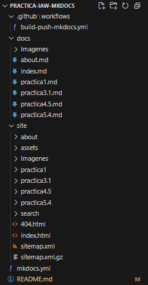

# Practica-IAW-MKDocs: Creación de un sitio web estático con MkDocs y GitHub Pages

## Estructura de la Práctica




## Objetivo de la Práctica

El objetivo de esta práctica es aprender a crear, personalizar y desplegar un sitio web utilizando MkDocs y el theme "Material for MkDocs". Para ello, se utilizarán herramientas como Docker para la ejecución del entorno, y GitHub Pages para la publicación del sitio web.

Además, se implementará un flujo de integración y despliegue continuo (CI/CD) con GitHub Actions, permitiendo que la documentación se actualice automáticamente con cada cambio en el repositorio.


## Desarrollo de la práctica 


- **`build-push-mkdocs.yml`:** Este archivo configuramos el workflow de GitHub Actions. Cuyo propósito es automatizar la publicación de la documentación creada con MKDocs en GitHub Pages cada vez que realizamos un push en la rama "main".


**Contenido del archivo:** 
   
   ```bash

    name: build-push-mkdocs

# Eventos que desescandenan el workflow
on:
  push:
    branches: ["main"]

  workflow_dispatch:

# A workflow run is made up of one or more jobs that can run sequentially or in parallel
jobs:

  # Job para crear la documentación de mkdocs
  build:
    # Indicamos que este job se ejecutará en una máquina virtual con la última versión de ubuntu
    runs-on: ubuntu-latest
    
    # Definimos los pasos de este job
    steps:
      - name: Clone repository
        uses: actions/checkout@v4

      - name: Install Python3
        uses: actions/setup-python@v4
        with:
          python-version: 3.x

      - name: Install Mkdocs
        run: |
          pip install mkdocs
          pip install mkdocs-material 

      - name: Build MkDocs
        run: |
          mkdocs build

      - name: Push the documentation in a branch
        uses: s0/git-publish-subdir-action@develop
        env:
          REPO: self
          BRANCH: gh-pages # The branch name where you want to push the assets
          FOLDER: site # The directory where your assets are generated
          GITHUB_TOKEN: ${{ secrets.GITHUB_TOKEN }} # GitHub will automatically add this - you don't need to bother getting a token
          MESSAGE: "Build: ({sha}) {msg}" # The commit message

   ```


Dado el contenido del archivo entero iremos desglosándo poco a poco explicando la función de cada bloque de comandos.


En primer bloque, declaramos que el servicio va a ser llamado "mysql", le especificaremos la imagen de MySQL, que en este caso será la versión 8.0 de Docker Hub.


En este caso, definiremos el servicio phpmyadmin, dónde le especificamos la imagen de phpmyadmin, le indicaremos los puertos de forma que en el host (navegador) su puerto sea el 8080, pero dentro del contenedor su puerto sea el 80.


Cómo es de esperar, declaramos el servicio https-portal actuándo cómo servidor proxy inverso con soporte HTTPS.


En último lugar del archivo, indicaremos los volúmenes para la persistencia de datos y le indicaremos las redes, que cómo hemos mencionado anteriormente, hemos definido la red frontend y backend.


Tras explicar la función del archivo, seguimos con el desarrollo de la práctica.


### Variables incluidas en el archivo ".env"


### Comprobaciones generales

Una vez redactados los comandos útiles, probaremos la ejecución del script a modo que se ejecute sin errores.


Tras ejecutar el script, nos dirigimos a la página de nuestro dominio y cómo podemos observar cargará nuestro sitio de Wordpress. Si nos fijamos, cargan correctamente los datos ya qué cómo "Título del Sitio" un nombre personalizado y tras implementarlo, podemos ver que el nombre figura correctamente.


