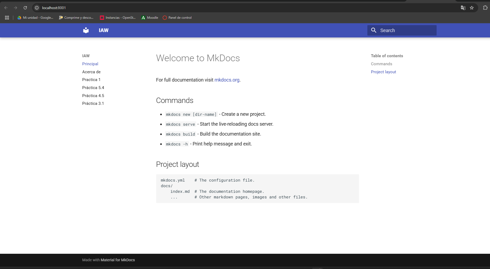

# Practica-IAW-MKDocs: Creación de un sitio web estático con MkDocs y GitHub Pages

## Estructura de la Práctica


## Objetivo de la Práctica

El objetivo de esta práctica es aprender a crear, personalizar y desplegar un sitio web utilizando MkDocs y el theme "Material for MkDocs". Para ello, se utilizarán herramientas como Docker para la ejecución del entorno, y GitHub Pages para la publicación del sitio web.

Además, llevaremos a cabo el proceso de integración y despliegue continuo (CI/CD) con GitHub Actions, permitiendo que la documentación se actualice automáticamente con cada cambio en el repositorio.


## Desarrollo de la práctica 

En primer lugar, crearemos nuestro proyecto con MKDocs y el tema Material usando Docker (Asegurándonos de tener Docker instalado en nuestro sistema). 


Realizado lo anterior, configuraremos el archivo "mkdocs.yml" para personalizar a nuestro gusto el nombre del sitio, el tema...


- **`mkdocs.yml`:** En este archivo se guardará la configuración principal de un proyecto MkDocs. Su función es definir cómo se estructurará y personalizará el sitio web de la documentación generada.


```bash

    site_name: IAW

    nav:
        - Principal: index.md
        - Acerca de: about.md
        - Practica 1: practica1.md
        - Práctica 5.4: practica5.4.md
        - Práctica 4.5: practica4.5.md
        - Práctica 3.1: practica3.1.md

    theme: material

```


Ahora, iniciaremos el servidor, esto nos servirá para poder visualizar el sitio a través del navegador.


Para comprobar el resultado, abriremos nuestro navegador y introducimos la IP de la máquina dónde estemos realizando la práctica y al final introducimos :8000.





En siguiente lugar, generaremos la documentación de nuestro sitio web de forma que no haga falta tener que iniciar el servidor local de desarrollo. 


- **`build-push-mkdocs.yml`:** Este archivo configuramos el workflow de GitHub Actions. Cuyo propósito es automatizar la publicación de la documentación creada con MKDocs en GitHub Pages cada vez que realizamos un push en la rama "main".


**Contenido del archivo:** 
   
```bash

    name: build-push-mkdocs

# Eventos que desescandenan el workflow
on:
  push:
    branches: ["main"]

  workflow_dispatch:

# A workflow run is made up of one or more jobs that can run sequentially or in parallel
jobs:

  # Job para crear la documentación de mkdocs
  build:
    # Indicamos que este job se ejecutará en una máquina virtual con la última versión de ubuntu
    runs-on: ubuntu-latest
    
    # Definimos los pasos de este job
    steps:
      - name: Clone repository
        uses: actions/checkout@v4

      - name: Install Python3
        uses: actions/setup-python@v4
        with:
          python-version: 3.x

      - name: Install Mkdocs
        run: |
          pip install mkdocs
          pip install mkdocs-material 

      - name: Build MkDocs
        run: |
          mkdocs build

      - name: Push the documentation in a branch
        uses: s0/git-publish-subdir-action@develop
        env:
          REPO: self
          BRANCH: gh-pages # The branch name where you want to push the assets
          FOLDER: site # The directory where your assets are generated
          GITHUB_TOKEN: ${{ secrets.GITHUB_TOKEN }} # GitHub will automatically add this - you don't need to bother getting a token
          MESSAGE: "Build: ({sha}) {msg}" # The commit message

   ```


En último lugar del archivo, indicaremos los volúmenes para la persistencia de datos y le indicaremos las redes, que cómo hemos mencionado anteriormente, hemos definido la red frontend y backend.


### Comprobaciones generales

Una vez redactados los comandos útiles, probaremos la ejecución del script a modo que se ejecute sin errores.


Tras ejecutar el script, nos dirigimos a la página de nuestro dominio y cómo podemos observar cargará nuestro sitio de Wordpress. Si nos fijamos, cargan correctamente los datos ya qué cómo "Título del Sitio" un nombre personalizado y tras implementarlo, podemos ver que el nombre figura correctamente.


