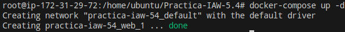
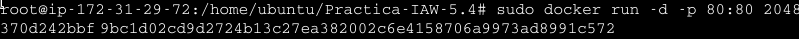

# Practica-IAW-5.4: Dockerizar una web estática y publicarla en Docker Hub

## Objetivo de la Práctica

El objetivo de la práctica será crear un archivo "DockerFile" con Nginx para generar una imagen Docker que contenga una aplicación web estática. Desplegaremos dicha imagen en una máquina de EC2 con Docker y Docker Compose.


## Estructura de la Práctica


## Desarrollo de la práctica 


- **`Dockerfile`:** Este archivo crea una imagen de Docker basada en Nginx y configura un entorno para servir la aplicación web 2047, tras citar el contenido del archivo, iremos explicando la función de cada línea.


**Contenido del archivo:** 
   
```bash
        FROM nginx:latest

        LABEL AUTHOR="JUAN"
        LABEL DESCRIPTION="2048"

        RUN apt-get update \
            && apt-get install -y git \
            && rm -rf /var/lib/apt/lists/*

        RUN git clone https://github.com/josejuansanchez/2048.git /app \
            && cp -R /app/* /usr/share/nginx/html/

        EXPOSE 80

        CMD ["nginx", "-g", "daemon off;"]

```

En primer lugar, especificaremos que usaremos la imagen de docker basada en Nginx.

En segundo lugar, añadiremos metadatos indicando el autor y la descripción, en el caso de autor será mi nombre, y en el caso de Descripción, le indicaremos el contenido de la imagen.

Ejecutaremos algún comando de actualización, instalaremos git ya que es necesario para clonar el repositorio de la aplicación, y limpiaremos archivos de instalación para reducir el tamaño de la imagen.

En siguiente lugar, clonaremos el respositorio de la aplicación web y copiaremos los archivos al directorio de Nginx.

Indicaremos que el contenedor usará el puerto 80 y por último, ejecutaremos Nginx.


Tras explicar la función del primer archivo, explicaremos la función del archivo "publish-to-docker-hub.yml" alojado en el directorio ".github/workflows".


- **`publish-to-docker-hub.yml`:** Este archivo es un workflow de Github Actions que automatiza la construcción y publicación de una imagen Docker Hub cada cez que se realiza un push a la rama main.


```bash
        name: Publish image to Docker Hub

    # This workflow uses actions that are not certified by GitHub.
    # They are provided by a third-party and are governed by
    # separate terms of service, privacy policy, and support
    # documentation.

    on:
    push:
        branches: [ "main" ]
        # Publish semver tags as releases.
        tags: [ 'v*.*.*' ]
    workflow_dispatch:

    env:
    # Use docker.io for Docker Hub if empty
    REGISTRY: docker.io
    # github.repository as <account>/<repo>
    #IMAGE_NAME: ${{ github.repository }}
    IMAGE_NAME: 2048
    IMAGE_TAG: latest

    jobs:
    build:

        runs-on: ubuntu-latest
        permissions:
        contents: read
        packages: write

        steps:
        - name: Checkout repository
            uses: actions/checkout@v3

        # Set up BuildKit Docker container builder to be able to build
        # multi-platform images and export cache
        # https://github.com/docker/setup-buildx-action
        - name: Set up Docker Buildx
            uses: docker/setup-buildx-action@f95db51fddba0c2d1ec667646a06c2ce06100226 # v3.0.0

        # Login against a Docker registry except on PR
        # https://github.com/docker/login-action
        - name: Log into registry ${{ env.REGISTRY }}
            uses: docker/login-action@343f7c4344506bcbf9b4de18042ae17996df046d # v3.0.0
            with:
            registry: ${{ env.REGISTRY }}
            username: ${{ secrets.DOCKERHUB_USERNAME }}
            password: ${{ secrets.DOCKERHUB_TOKEN }}

        # This action can be used to check the content of the variables
        - name: Debug
            run: |
            echo "github.repository: ${{ github.repository }}"
            echo "env.REGISTRY: ${{ env.REGISTRY }}"
            echo "github.sha: ${{ github.sha }}"
            echo "env.IMAGE_NAME: ${{ env.IMAGE_NAME }}"

        # Build and push Docker image with Buildx (don't push on PR)
        # https://github.com/docker/build-push-action
        - name: Build and push Docker image
            id: build-and-push
            uses: docker/build-push-action@0565240e2d4ab88bba5387d719585280857ece09 # v5.0.0
            with:
            context: .
            push: ${{ github.event_name != 'pull_request' }}
            tags: ${{ env.REGISTRY }}/${{ secrets.DOCKERHUB_USERNAME }}/${{ env.IMAGE_NAME }}:${{ env.IMAGE_TAG }}
            cache-from: type=gha
            cache-to: type=gha,mode=max          
```

En primer lugar, definiremos el nombre del workflow cómo "Publish image to Docker Hub", este nombre será visible en la pestaña "Actions" de Github.


Se ejecutará cuando se hace un push a main o cuándo se cree un tag con el formato "vX.Y.Z". Permitiendo también ejecutar el workflow manualmente desde Github Actions.


Tendremos una sección de variables de entorno, dónde usará Docker Hub cómo registro de imágenes, le indicaremos el nombre de la imagen Docker que se construirá y le asignaremos la etiqueta "latest" a la imagen.


Definiremos el job llamado build, dónde especificamos que se ejecuta en una máquina virtual de ubuntu y tendrá permisos de solo lectura para el código fuente y permisos de escritura para subir la imagen Docker.


En siguiente lugar, clonaremos el respositorio usando la acción "checkout@v3".


El siguiente paso será configurar Docker Buildx, dónde lo habilitaremos para poder construir imágenes optimizadas y multiplataforma.

Lo siguiente será iniciar sesión en Docker Hub, usando las credenciales almacenadas en Secrets de Github, en este caso tendremos los secrets "DOCKERHUB_TOKEN" y "DOCKERHUB_USERNAME", dónde tendremos un token de Docker Hub de forma que no haya que introducir cada vez que realizemos alguna operación las credenciales de DockerHub.

Cabe decir que la sección "Secrets" es una forma segura de manejar las credenciales en GitHub Actions.

Tras explicar el apartado anterior, seguiremos explicando, en este caso la sección Debug, significándo esto que imprime en la consola algunas variables para verficar que tienen los valores correctos.

Por último lugar, construiremos y subiremos la imagen a Docker Hub.

Tras explicar todas las líneas del archivo, visualizaremos el Token Creado de DockerHub para posteriormente visualizarlo en Github Actions Secret.


### Comandos a ejecutar en la máquina

Una vez llegados a este punto, redactaremos los comandos usados para el desarrollo del proceso de la publicación de nuestra imagen en Docker Hub.

En primer lugar, usaremos el comando "docker build -t juangarcia24/2048 ."
para crear la imagen de Docker a partir del archivo explicado anteriormente Dockerfile.

Ahora, con el comando docker tag juangarcia24/2048 juangarcia24/2048:1.0" le añadiremos una etiqueta a la image, en este caso siendo "1.0".


Acto seguido, con el comando "docker-compose" lanzaremos el docker.




En siguiente lugar, para comprobar que la imagen se ha creado correctamente ejecutaremos el comando "docker images" para listar las imagenes guardadas en nuestro sistema.


Realizado lo anterior, tendremos que iniciar sesión con el usuario y contraseña de DockerHub con el comando "docker login -u juangarcia24". Pedirá la introducción de una contrseña, en este caso, la contraseña a introducir será el token de DockerHub creado anteriormente.


En siguiente lugar, procedemos a realizar un push para poder publicar la imagen, lo realizaremos con las dos etiquetas creadas:


Si pulsamos sobre los detalles del commit, figura que se ha publicado correctamente en Docker Hub.


Por último, probaremos a dirigirnos a la página de Docker Hub para comprobar la existencia de nuestra imagen creada y sincronizada.


### Comprobación de funcionamiento

Llegados a este punto de la práctica, comprobaremos que se ha implantado correctamente la aplicación web, por lo que, en primer lugar, la arrancamos con el siguiente comando:

```bash
    docker run -d -p 80:80 2048
```




Ahora, introducimos en nuestro navegador la IP elástica de la máquina y comprobamos que carga la aplicación Web.


